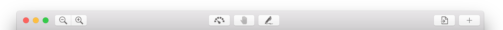
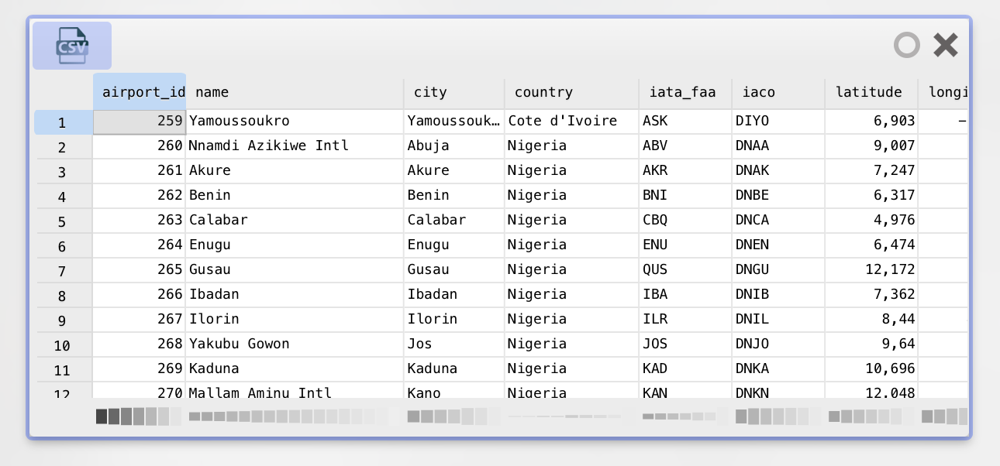
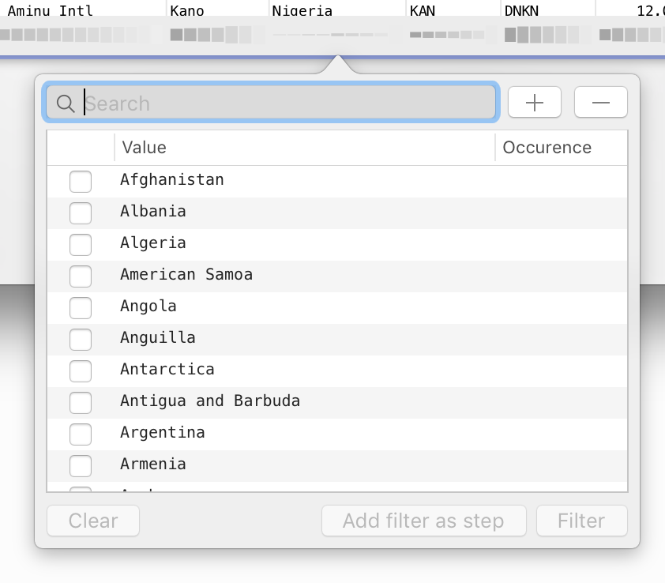
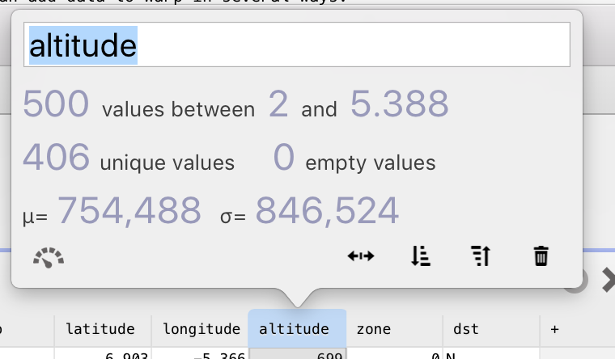
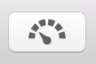
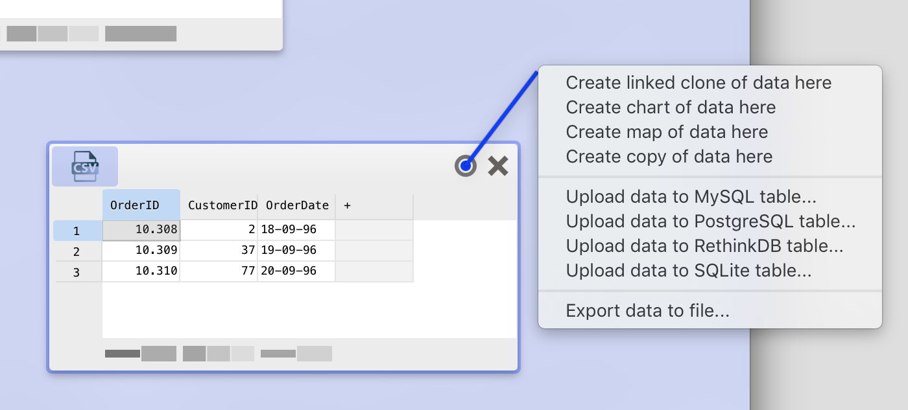

# Getting to know Warp

When you first open Warp and complete the guided tour, Warp will show a new, empty *Warp document*. A document can contain various items, such as data sets and charts. These items are called *tablets*. Tablets are resizable and can be placed anywhere in the workspace. You can remove a tablet from the document by clicking the 'X' on the top right of the tablet. 

The top bar shows several buttons. On the left side, there are buttons that allow you to zoom in on a particular tablet, or zoom out to see all tablets in the document. On the right of the toolbar are buttons that can be used to add new tablets, or export data from a tablet. In the middle are buttons that control data calculation inside a tablet. Note that some of these buttons only work when a tablet is selected. The selected tablet is marked with a blue border.

Below the toolbar is the so-called *sentence bar*. If you select a tablet, the sentence bar will show a description of the tablet. The sentence contains blue tokens that can be changed. In the example above, you can tell the tablet to load data from a different table or database. Some tablets provide more advanced configuration options - these can be accessed using the button on the right.

## Adding data

You can add data to Warp in several ways:

* You can drag files (e.g. from the Finder) to the Warp document. Warp supports common text formats, such as CSV or tab-separated data. You can also drag in multiple files at once.
* You can use the '+' button in the top right of the window to add data. You can load files from here, as well as connect to databases to get data.

If you add data to Warp, the data itself is not added to the Warp document. Rather, the document *references* the source of the data (e.g. the path of the file, or the connection details and table name of a database table). If the source changes, so will your data in Warp (after you refresh it or reopen the document in Warp).

## Viewing data

After adding data to Warp, you will see a tablet that looks more or less like this:

On the top of the tablet, there is an icon that indicates what data is displayed in the tablet, in this case data from a CSV file. The table shows the data inside the CSV file.  

On the bottom of the table are icons that give an indication of how many different values there are in a column. If you click one of these, you will be shown a popup where you can filter the table for certain values:

If you double click a column's name, you will be shown an overview of the data in the column in numerical terms:

## Analyzing data

You can perform various analysis and transformation operations on data inside Warp. Many of these operations are available from the menu bar at the top, or can be accessed by right-clicking a row, column or cell in the data table. 

If you perform an operation on data in Warp, the source data will not be modified. Rather, Warp will save the operation as a 'step'. At the top of a data tablet, icons will show that indicate the various steps applied to the data. 

You can remove a step by right-clicking it and selecting 'remove step'. You may also re-order steps by dragging them. If you select a step, Warp shows the resulting data up to and including that step. The sentence bar generally shows information on the currently selected step for the currently selected tablet. 

You can change values inside the data table by double-clicking a cell and changing the value. After you have made your change, Warp will try to understand what you did. If, for instance, you changed a text from lowercase to uppercase, Warp will see this and try to apply the same operation to all values in the column. 

Sometimes, Warp does not understand your modifications. In this case, you can try to select an alternative proposal. You can do this by right-clicking a step and selecting 'show alternatives'. You can also access the list of alternatives for the currently selected step using the ⌘1 key combination, or cycle through alternatives by repeatedly pressing the ⌘2 key combination.

## Small or big?

In order to make working with very large data sets as fast as possible, Warp will show you an 'example' result most of the time. This is a result based on a small, randomly selected subset of the original data. You can notice Warp is showing you an example result by looking at the 'speed indicator' button at the top:

If you click this button, it will start a calculation of the full result, using all data. If the full result is shown, the button will turn blue:

Note that example data is only used inside Warp. If you export data from Warp, it will always export the full data.

## Changing data

If you do want to change the source data, this is possible from inside Warp as well. Simply click the 'pen' toolbar item in the toolbar to start editing the currently selected tablet. The pen button will turn blue when editing is enabled. When you are done, click the button again to leave edit mode.

Not all data sources support editing data. Most importantly, you cannot edit data in CSV files. In general, you can edit data from database tables that have a primary key defined. If no primary key is defined, Warp will ask you to select a set of columns that it can use to uniquely identify rows. 

## Linking data

In Warp, you can easily link together two data sets ('joining' in database parlance). You can create a link by adding two tables to a Warp document, and then dragging an arrow from the circle in the top left corner of one data tablet to another:

After dropping the arrow on a tablet, Warp will ask you how you want to link the data (you can either join rows or append one data set to the other). If you choose to join rows, Warp will look at the column names in both data sets - if there is a column that appears in both, it will use that column to match rows. If Warp cannot determine how the tables should be linked, you can configure it afterwards using the sentence bar.

To show the tables are linked, Warp will show a gray arrow between the tablets in the document. Also, Warp will not allow a tablet that provides data to another tablet to be removed.

## Exporting data

To export data from Warp, select a tablet and click the 'export' button in the top right corner of Warp. You may also drag an arrow to a folder outside Warp (e.g. in the Finder). 

In order to export data to a database ('upload data') you should drag an arrow from the data tablet to an empty spot in the document. Warp will then ask you where you want to put the data:

Warp will subsequently show you a window where you can configure the details of how the data is uploaded to the database. If you are uploading data to a table that already exists, Warp needs to know how the columns in the source data set are mapped to the columns that already exist.

You may create a new table by clicking the 'cog' button and clicking the 'create new table' button at the bottom of the pop-up.

## Moving data around

By dragging an arrow from one data tablet onto another tablet stored in a database, you can easily append or replace the data in the database table with new data. This allows you to quickly move data around.
