# Tutorial: crawling a website with Warp

With Warp, it is easy to download data from websites for analysis. In this tutorial, you'll learn how to use Warp's advanced features for crawling.

Many websites that show interesting data do so using JavaScript, and fetch their data from a JSON API. An example is the website of the Amsterdam Internet Exchange, which provides historical traffic statistics on [this page](https://ams-ix.net/technical/statistics/historical-traffic-data). 

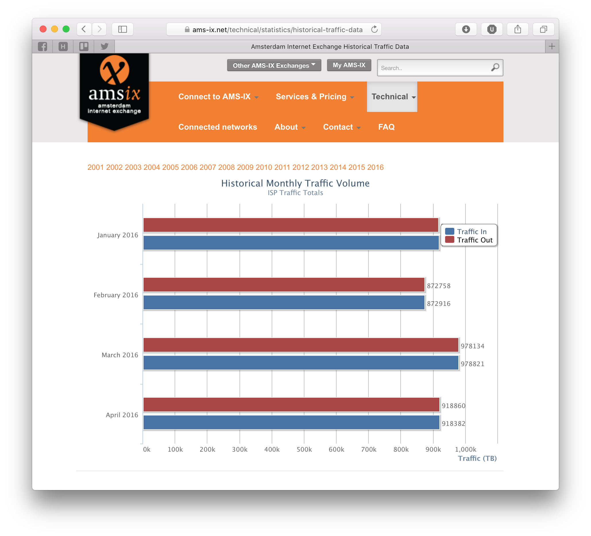


Using (for instance) the web tools provided in [Chrome](http://www.google.com/chrome), you can  easily find that the charts on the AMS-IX stats page are based on data that is fetched from the URL **https://ams-ix.net/historic_traffic_data?year=XXXX** where the 'XXXX' is replaced with the year selected. The data at this URL looks as follows:

````
[
	{"date":"January 2015","in_traffic":694522,"out_traffic":694280},
	{"date":"February 2015","in_traffic":645772,"out_traffic":645671},
	...
	{"date":"December 2015","in_traffic":863195,"out_traffic":863054}
]
```` 

Obviously, this data is in [JSON](https://en.wikipedia.org/wiki/JSON) format, so it should be no problem to read it. First however, we need to fetch the JSON data for all the years we're interested in. AMS-IX provides data for the years 2001 to 2016, so let's just fetch all of those. 

## Step 1: Make a list of URLs 

In order to crawl data from multiple URLs, you first need to make a list of URLs in Warp. Let's start by generating a list of years we're interested in by selecting the '+' button in the top right and selecting 'Generate a sequence'. We want to generate a sequence of numbers between 2001 and 2015, and put each number of the sequence in a column called 'Year'. After configuring the sequence you should end up with something like this:

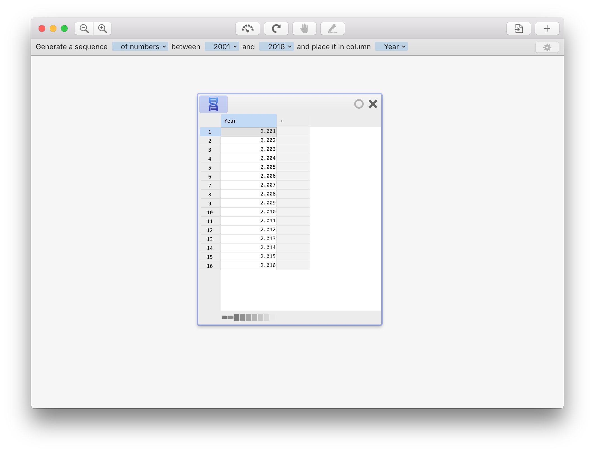

Now, we need to calculate the URL for each year. In order to do so, add a new column by typing the following formula in the '+' column to the right of the years:

````
="https://ams-ix.net/historic_traffic_data?year="&[@Year]
````

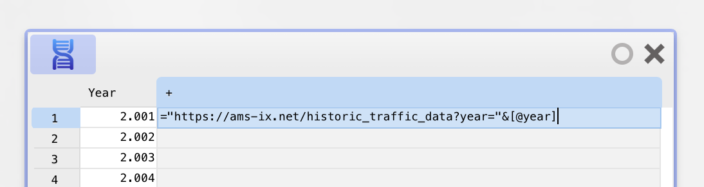

The formula basically concatenates the data URL without the year to the year in the 'Year' column. Warp will add a step that calculates the column. Change the name of the column to read 'URL'. You should now see something like the following.

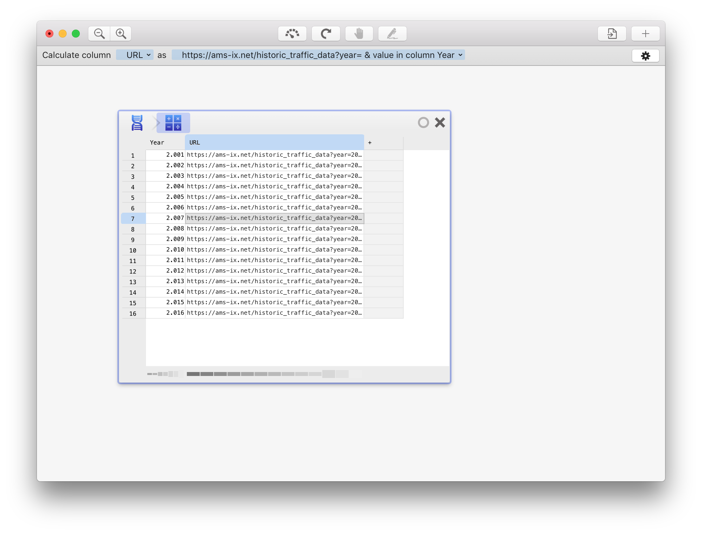

## Step 2: Let Warp fetch the data

Now that we have the URLs of the URLs we need to fetch, we can ask Warp to fetch the data at each URL. In order to do so, select 'Crawl data' from the 'Table' menu. Warp will add a new 'crawl data' step. Select the URL in the top bar and change it so that Warp reads the URL to fetch from the 'URL' column, like so:

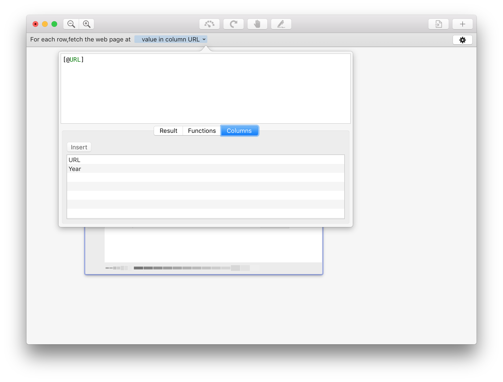

You also need to tell Warp where to put the data. To do so, click the 'cog' button to the top right and tell it to put the content in column 'Content':

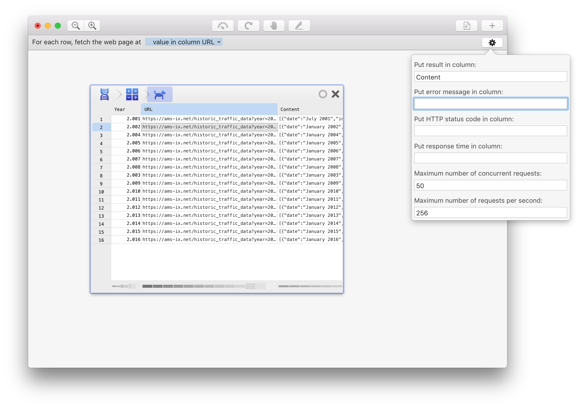

If you are worried that the web site will return errors for some URLs, or you are interested in the response time, you can tell Warp to save those as well. Also pay attention to the maximum number of concurrent requests and total requests per second - you don't want to overload the site you're crawling!

## Step 3: Interpret the data

You will now see that Warp has put the JSON data for each year in the 'Content' column. As this is still JSON formatted, we first need to read it into a format Warp understands. To do so, you can use the 'FROM.JSON' function. In the 'Content' column, type the following formula:

````
=FROM.JSON(@)
````

This will instruct Warp to re-calculate the data in the 'Content' column, by applying the FROM.JSON function to the contents in the column (the '@' sign indicates 'current column' - the formula is equivalent to FROM.JSON([@Content])).

You will now see that the contents of the 'Content' column have changed - but they are not exactly readable just yet. What happened? Well, Warp read the JSON value and as it is an array, it translated it to a so-called 'pack formatted value' - basically a comma-separated list of the values in the array. Each value in the array represents an object with data on a particular month. We therefore need Warp to split the list into values for each month. To do so, make sure the 'Content' column is selected, and then choose 'Split list in column to rows' from the 'Rows' menu. 

You should now see 12 times as many rows as before, as now each row represents a month rather than a full year of data.

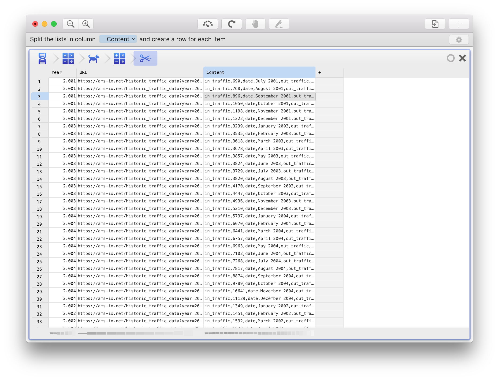

If you look closely, you will see that the data is again a list, but now formatted according to a certain pattern: it first lists the label of the value, then a comma, then the value for that label, then another label, and so on. We can extract relevant values by using the 'NTH' function - it looks for a certain label and returns the value next to it.

Seeing is believing - create a new column by typing the following formula in the '+' column:

````
=NTH([@Content]; "date")
````

This will extract the 'date' value from the list. You will also want the in_traffic data point (````=NTH([@Content];"in_traffic")````). Make sure to give the new columns proper names. You may also remove the other columns at this point. After this, you will have a nice data set!

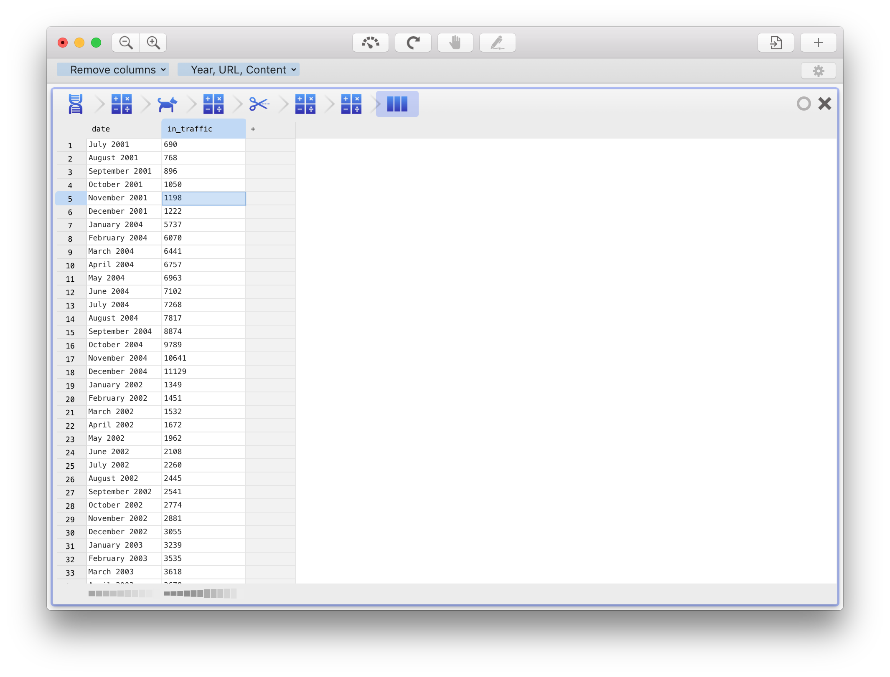

## Step 4: make a chart 

You can now visualize this data set by clicking the circle to the top right of the table, and choosing "Create a chart from the data". Select 'Line chart' for the best results:

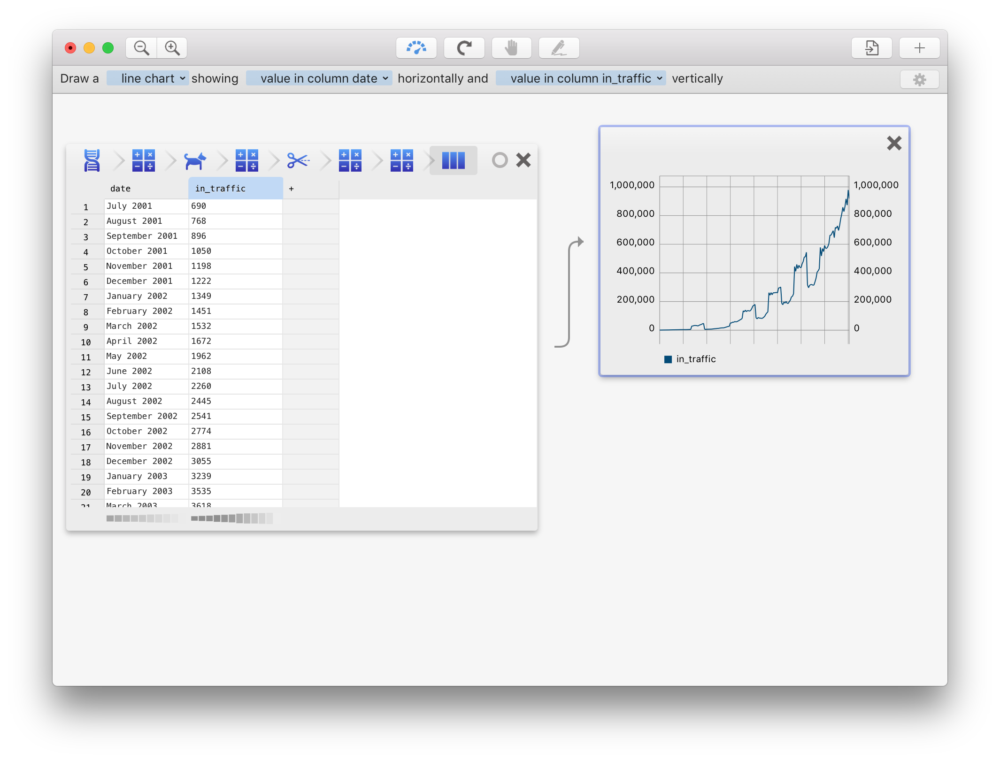

Now that the crawling works, it's time to hit the 'Calculate' button in the top toolbar to let Warp fetch all data (this can take a while if you are fetching a lot of data!). You can then use the circle at the top right to export this data to someplace else, e.g. a database or a file.

## Bonus step: month numbers

Notice how the 'Date' column contains dates formatted as 'Month Year' - what if you wanted to have the month number and year in separate columns? This is easy to fix in Warp. First, we need to split the month name from the year. To do so, add two columns with the following formulas:

````
=NTH(SPLIT([@Date];" ");1)
=NTH(SPLIT([@Date];" ");2)
````
These formulas tell Warp to split the data in column 'Date' at each space, and then taking the first and second item which are the month name and the year, respectively. As these formulas are difficult to type, you may also try to type the year of a particular date in the new column, and Warp will likely automatically write the formula for you!

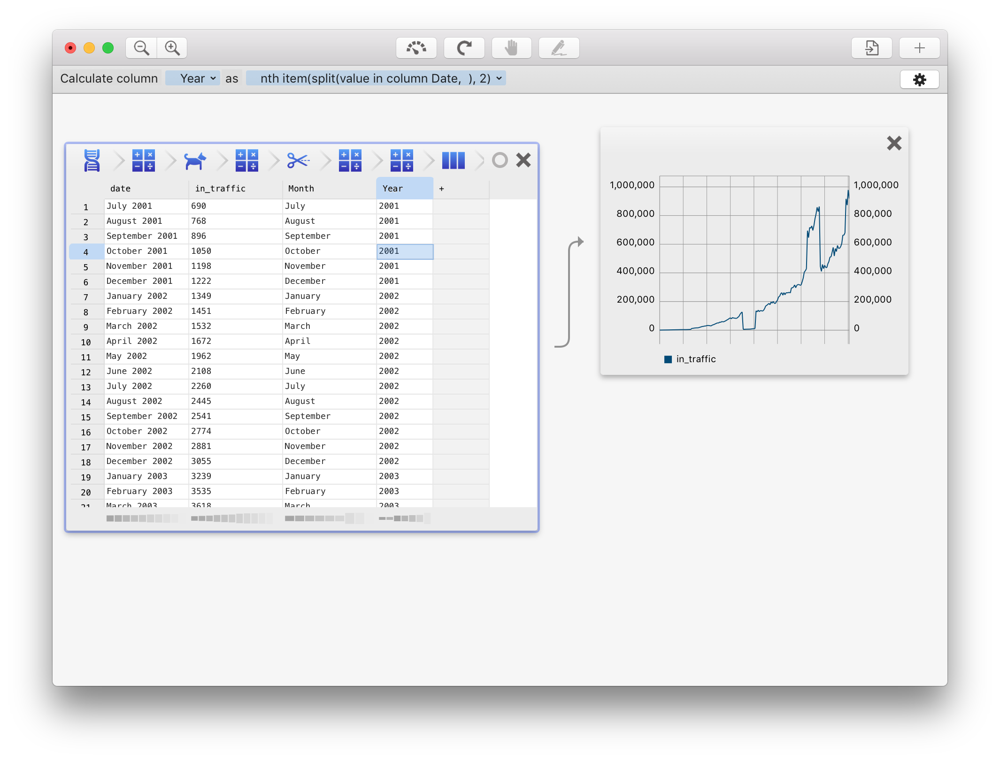

Now, in order to translate the month names in the 'Month' column to numbers, we can use a **look-up table**. To make one, drag the 'Month' column outside the table to an empty spot in the workspace, and select 'Create look-up table'. Warp will create a table containing all unique month names in the 'Month' column. 

Select this table and click the edit button in the top toolbar. You can now assign each month a number. When you're done, refresh the data in the original table. You will see that Warp copied the month number from your look-up table to the main table.

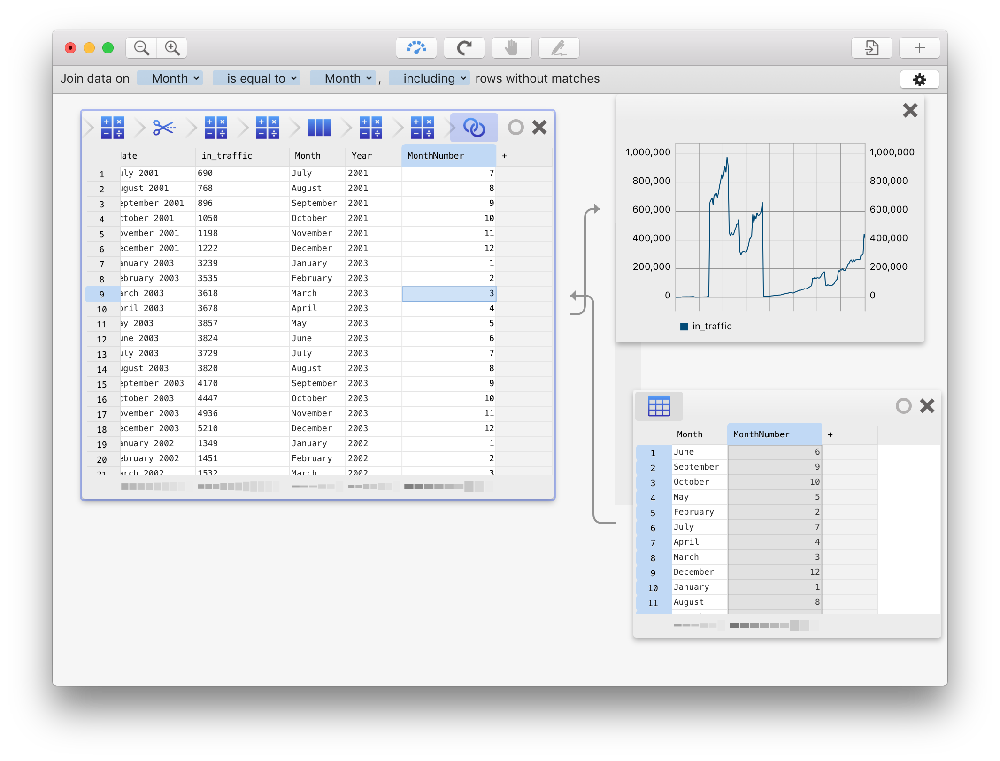
