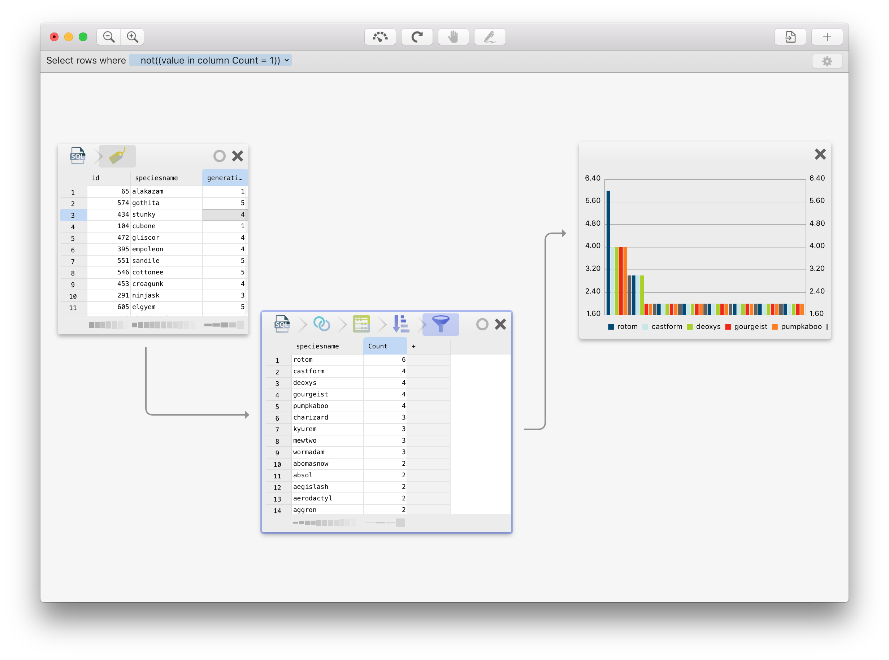

Warp - Convert and analyze large data sets at light speed
---------------------------------------------------------

Warp allows you to convert and analyze (very) large databases with ease at the speed of light. In Warp, you work on a small subset of the data, after which Warp repeats your actions on the entire dataset. Unlike most data analysis apps, you do not have to type any codes in Warp.

* Read data from files (e.g. CSVs), databases (MySQL, PostgreSQL or SQLite) or even big data warehouses (RethinkDB and Facebook Presto)

* Effortlessly juggle around data between files and databases by simply dragging-and-dropping! Load CSV files into MySQL or transfer a PostgreSQL table to a RethinkDB table by just dragging one to the other.

* Efficiently analyze large datasets: Warp works closely together with databases to deliver the best performance. 

* Work faster by creating your analysis on a small subset of the data, then run it on all data with only a single click

* Use the same formulas and techniques (such as pivot tables) you already know from Microsoft Excel™

* Easily re-run an analysis on different data, possibly from different sources

* Easy-to-use, drag and drop interface, but the pro features are never more than a click away.

Download Warp from the [Mac App Store](https://itunes.apple.com/us/app/warp/id973942134?l=nl&ls=1&mt=12&ct=github).



### Why Warp was created

While there are many nice Mac applications for connecting to databases (e.g. Sequel Pro), none of them provide an integrated environment for working with data from different sources (databases and files) with the ease-of-use of a spreadsheet. I started work on Warp in 2014 primarily to fill this void.

## Implementation details

Warp consists of three components:

* __WarpCore__ (framework) provides a common substrate for dataset operators. It defines value types, data operations and provides an in-memory implementation for each, as well as the building blocks for creating SQL.
* __WarpConduit__ (framework) provides implementations of WarpCore's primitives for different databases and file formats. It links client libraries for RethinkDB, MySQL and PostgreSQL at this point. 
* __Warp__ (app) is the Mac (Cocoa) desktop app.

The __Docs__ folder contains documentation (written in MarkDown, using [mkdocs](http://mkdocs.org)).

### The WarpCore data processing framework

WarpCore revolves around the `Dataset` protocol, wich provides a high level interface for data operations, such as `transpose`, `filter`, `sort`, et cetera. All operations return a new `Dataset` object. 

Calculation happens lazily: the user can either call the `raster` method to obtain an in-memory result, or call `stream` to obtain a (lazy) streaming interface to the result (`Stream`). The `CoalescedDataset` class performs transparent re-ordering and deduplication of operations to improve performance.

Streams provide an asynchronous method for fetching columns (`columns`) as well as a method to fetch a block of rows (`fetch`). Multiple fetches can be performed concurrently. The `StreamPuller` class provides a way to start concurrent fetches on a stream (which is advantageous in many cases, e.g. calculating a new column can be done on multiple threads in parallel). All asynchronous operations use the `Fallible<T>` enum to return a result (`.success(let result: T)`) or failure(`.failure(let errorMessage: String)`). A `Transformer` is a stream that reads from another stream in order to produce its output.

In-memory datasets are represented using the `Raster` class. A raster consists of an ordered set of unique `Column`s, and an ordered list of rows. Column names must be non-empty, and are compared case-insensitively, but retain their original case. Each row contains exactly as many `Value`s as there are columns. 

Values are typed, but can be implicitly converted. The different types are string, double, integer, boolean, datetime, empty (analogous to SQL NULL) and invalid.

Data sources that support it can implement the `MutableDataset` protocol to also support certain mutations, such as schema updates, row insertion and removal.

WarpCore provides an implementation of `Dataset` and `MutableDataset` that generate SQL. In order to use it, either should be subclassed in order to (1) submit the generated query to the database, and (2) provide a `SQLDialect` object that provides information on the specific way in which the database expects the SQL to be written.

Many data operations accept expressions (`Expression` class), e.g. for sorting, filtering, calculating a new column, et cetera. An expression can be built using `Formula` (a formula parser) or programmatically (through the `Literal`, `Comparison`, `Call`, `Sibling` and `Foreign` classes). Formula parsing is localized using the `Language` class, which translates formula names. Functions are provided by the `Function` enum whereas binary operators are in the `Binary` enum.

### The WarpConduit data source bridges

WarpConduit provides `Stream` and `Dataset` (from WarpCore) implementations that bridge to native client libraries for various databases and file formats. 

### The Warp app
The Warp desktop application consists of a document (`QBEDocument`) which holds a collection of tablets (`QBETablet`), which currently can be a `QBENoteTablet`, `QBEChartTablet` or `QBEChainTablet`. 

A chain (`QBEChain`) is an ordered list of `QBEStep`s, each of wich perform an operation on the output of the previous step. A `QBEStep` provides either a full dataset as output (`fullDataset` method) or an 'example' dataset (`exampleDataset`). The latter is used to give the user an idea of what he or she is doing to the data, without actually performing the full calculation. Under the hood, both methods call the various methods on `Dataset` to do their work. 


A `QBEStep` can be configured throgh wat is called a 'sentence' (`QBESentence`). A sentence is a textual description of what the step will do, containing tokens that the user can modify to change the behaviour. An example of a sentence is "Select the top X rows", where X is a token connected to the variable `numberOfRows` on `QBELimitStep`. A `QBEStep` can optionally provide a view for configuration of more advanced options. The `QBEFactory` class maintains mappings between `QBEStep`, configurator views, and step icons.


# Dependencies
Dependencies are fetched automatically as Git submodules. Currently the following are used:

### WarpCore
* [SwiftParserGenerator](https://github.com/dparnell/swift-parser-generator) for parsing formulas

### WarpConduit
* [Rethink-Swift](https://github.com/pixelspark/rethink-swift) for RethinkDB connectivity
* [TCXMLWriter](https://github.com/monkeydom/TCMXMLWriter) for writing to XML files.

### Warp
* [Charts](https://github.com/danielgindi/Charts) for chart drawing
* [Alamofire](https://github.com/Alamofire/Alamofire) for providing HTTP fetch and crawling functionality, as well as connectivity for Presto
* [MBTableGrid](https://github.com/pixelspark/mbtablegrid) for displaying data
* [SwiftAI](https://github.com/collinhundley/Swift-AI) for (experimental) machine learning features

WarpConduit contains precompiled (unmodified) binaries of libpq and libmariadbclient. It also contains [SQLite](http://www.sqlite.org), CHCSVParser (by Dave Delong) and portions of Shapelib (by Frank Warmerdam, for reading DBF). 

# Building

Warp is written in Swift 3.0. Building Warp requires XCode 8 (currently at beta 6) on OS X El Capitan or higher. After cloning the repository, run a `git submodule init && git submodule update` to fetch dependencies.

In order to use WarpCore and/or WarpConduit in your own projects, simply drag the corresponding .xcodeproj files to your project/workspace and add as target depdendency. For WarpCore, you need to add the SwiftParser framework (contained in the WarpCore project) to the 'copy files' build phase of your app (as well as WarpCore.framework itself, but XCode should do this automatically when adding it as a dependency). For WarpConduit, you need to add libmariadbclient.a and libpq.a to the list of binaries linked with, as well as add Rethink.framework to the 'copy files' phase. You should probably also link to libssl, libcrypto and libiconv. Check out Warp's project settings when in doubt.

# License

Warp is 'convenience-ware'. It can be downloaded from the Mac App Store at a reasonable price, providing you with updates and support from (Pixelspark)[https://pixelspark.nl]. Alternatively, you can download the source code and build Warp yourself. 

Warp is open sourced in order to (1) provide the community with a high-performance framework for handling big data sets in Swift, and (2) to encourage others to improve Warp in order to create the best big data transformation and analysis app there is. The licensing model reflects these objectives. The frameworks powering Warp's data engine (WarpCore and WarpConduit) are licensed under the liberal MIT license, which allows you to not only use these frameworks in your own (possibly commercial/proprietary) applications, and modify them for your own purposes (we still encourage you however to submit any improvements back to us!). The application itself is licensed under the GPLv2. This license basically requires you to open-source any modifications you make as well. 

Which license applies to which component is usually indicated at the top of each file. If not, by default all files in the 'WarpCore' and 'WarpConduit' directories are licensed under the MIT license (see below). All files in the 'Warp' directory are licensed under the GPLv2 (see Warp/LICENSE.md). Either component may contain third-party (open source) software, used under their respective licensing terms. 

### MIT license (WarpCore, WarpConduit)

```
Copyright (c) 2014-2016 Pixelspark, Tommy van der Vorst

Permission is hereby granted, free of charge, to any person obtaining a copy of this software and associated documentation files (the "Software"), to deal in the Software without restriction, including without limitation the rights to use, copy, modify, merge, publish, distribute, sublicense, and/or sell copies of the Software, and to permit persons to whom the Software is furnished to do so, subject to the following conditions:

The above copyright notice and this permission notice shall be included in all copies or substantial portions of the Software.

THE SOFTWARE IS PROVIDED "AS IS", WITHOUT WARRANTY OF ANY KIND, EXPRESS OR IMPLIED, INCLUDING BUT NOT LIMITED TO THE WARRANTIES OF MERCHANTABILITY, FITNESS FOR A PARTICULAR PURPOSE AND NONINFRINGEMENT. IN NO EVENT SHALL THE AUTHORS OR COPYRIGHT HOLDERS BE LIABLE FOR ANY CLAIM, DAMAGES OR OTHER LIABILITY, WHETHER IN AN ACTION OF CONTRACT, TORT OR OTHERWISE, ARISING FROM, OUT OF OR IN CONNECTION WITH THE SOFTWARE OR THE USE OR OTHER DEALINGS IN THE SOFTWARE.
```

# Contributing
We welcome contributions of all kinds - from typo fixes to complete refactors and new features. Just be sure to contact us if you want to work on something big, to prevent double effort. You can help in the following ways:

* Open an issue with suggestions for improvements
* Submit a pull request (bug fix, new feature, improved documentation)

Note that before we can accept any new code to the repository, we need you to confirm in writing that your contribution is made available to us under the terms of the MIT license.
